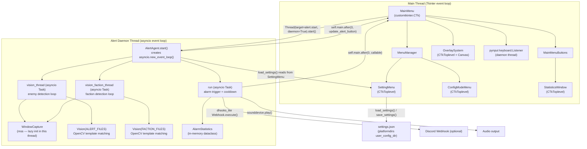

# COCO.md — EVE-Alert AI Context Document

> **For AI coding assistants.** This document is the canonical source of
> architecture, design decisions, and conventions for the EVE-Alert repository.
> Read this before touching any source file.

---

## 1. Project Purpose

EVE-Alert is a desktop PvP alert tool for the MMO **EVE Online**. It monitors a
configurable region of the screen (typically the in-game Local Chat roster) using
OpenCV template matching, and fires audio alarms plus optional Discord webhook
notifications when enemy players or faction spawns are detected.

**Primary platforms:** Windows (primary), macOS (supported). Distributed as a
standalone `.exe` (Windows) or `.app`/`.dmg` (macOS) built with PyInstaller.

**Version:** `evealert/__init__.py:__version__` is the single source of truth.

---

## 2. Architecture Overview

### Component Relationship Diagram



### Key Design Points

- The **Tkinter event loop** owns all GUI widgets and runs on the main thread.
- The **asyncio event loop** is created fresh inside `AlertAgent.start()` which
  runs in a daemon thread. This loop runs three concurrent tasks.
- `WindowCapture` uses `mss.mss()` created lazily on first call to
  `get_screenshot_value()`, ensuring the OS screen-capture handle is bound to
  the alert thread, not the GUI thread.
- The **pynput keyboard listener** runs in its own daemon thread (started by
  Tkinter's `init_menu`), stored as `self._keyboard_listener` and stopped in
  `clean_up()`.

---

## 3. Critical Thread Safety Rules

> **This is the most important section for AI agents.** Violating these rules
> causes silent corruption or hard crashes.

### Rule 1 — Never mutate Tkinter widgets from the alert thread

All customtkinter/tkinter widget calls (`configure`, `insert`, `delete`,
`after`, etc.) are **not thread-safe**. If code in `AlertAgent` or any async
task needs to update the GUI:

```python
# CORRECT — schedule on main thread
self.main.after(0, lambda: self.main.write_message("hello", "green"))

# WRONG — direct call from alert thread (may silently corrupt state or crash)
self.main.write_message("hello", "green")
```

### Rule 2 — `mss.mss()` must be created in the alert thread

`WindowCapture.__init__` sets `self._sct = None`. The actual `mss.mss()`
instance is created inside `_get_sct()` on first call to `get_screenshot_value()`
which happens inside `vision_check()` → called from `AlertAgent.start()` in the
daemon thread. **Never** move `mss.mss()` construction to `__init__`.

### Rule 3 — The asyncio event loop is created in the daemon thread

`AlertAgent.__init__` sets `self.loop = None`. The actual loop is created in
`AlertAgent.start()`:

```python
self.loop = asyncio.new_event_loop()
asyncio.set_event_loop(self.loop)
```

Do not create `asyncio.new_event_loop()` in `__init__`.

### Rule 4 — Stop the event loop thread-safely from the main thread

```python
# CORRECT
self.alert.loop.call_soon_threadsafe(self.alert.loop.stop)

# WRONG
self.alert.loop.stop()  # called directly from main thread
```

See `MainMenu.clean_up()` for the canonical shutdown sequence.

### Rule 5 — pynput keyboard listener must be stopped on teardown

The listener is stored as `self._keyboard_listener`. Always call
`self._keyboard_listener.stop()` before destroying the main window.

### Rule 6 — Cooldown timers are absolute future timestamps

```python
# CORRECT — store the future expiry time
self.cooldown_timers[alarm_type] = time.time() + self.cooldowntimer

# Check: current_time < expiry means still cooling
if time.time() < self.cooldown_timers[alarm_type]:
    return  # still in cooldown
```

---

## 4. File Map

### Root

| File | Purpose |
|------|---------|
| `main.py` | Entry point — sets CTk appearance, prints ASCII banner, instantiates `MainMenu`, calls `mainloop()` |
| `pyproject.toml` | Build config (hatchling), runtime deps, optional dev/build deps, version path |
| `pytest.ini` | Pytest config — `python_classes = *Tests`, `python_functions = test_*` |

### `evealert/`

| File | Purpose |
|------|---------|
| `__init__.py` | Package version: `__version__`, `__title__` |
| `constants.py` | All magic numbers and string constants — timing, UI dimensions, OpenCV params, audio, log config, image prefixes |
| `exceptions.py` | Custom exception hierarchy rooted at `EVEAlertException` |
| `hotkeys.py` | `parse_hotkey()`, `key_matches()`, `DEFAULT_HOTKEYS` — keyboard hotkey parsing shared by `SettingMenu` and `MainMenu` |
| `statistics.py` | `AlarmEvent` dataclass + `AlarmStatistics` dataclass — in-memory per-session alarm tracking with history deque (max 50) |
| `tray.py` | `TrayManager` — pystray daemon thread, minimize-to-tray, Show/Start/Stop/Exit tray menu |

### `evealert/manager/`

| File | Purpose |
|------|---------|
| `alertmanager.py` | `AlertAgent` — entire detection engine: asyncio task management, screenshot loop, template match dispatch, sound playback, webhook firing, cooldown logic |

### `evealert/menu/`

| File | Purpose |
|------|---------|
| `main.py` | `MainMenu` (CTk root window), `MainMenuButtons`, `MenuManager` — wires together all subsystems, handles start/stop, keyboard hotkeys, overlay, status polling |
| `setting.py` | `SettingMenu` + `DEFAULT_SETTINGS` — settings Toplevel window, load/save/merge/apply logic, audio test buttons |
| `config.py` | `ConfigModeMenu` — F1/F2 hotkey guide Toplevel, tracks `alert_region`/`faction_region` selection state |
| `image_manager.py` | `ImageManagerWindow` — add/remove/preview user template images; copies to platformdirs user `img/` directory |
| `statistics.py` | `StatisticsWindow` — two-tab Toplevel: Live Stats (real-time counts/history) and Sessions (past per-session JSON reports) |
| `threshold_editor.py` | `ThresholdEditorWindow` — per-image confidence toggle + slider; saves to `settings.json["image_thresholds"]` |

### `evealert/tools/`

| File | Purpose |
|------|---------|
| `intel_watcher.py` | `IntelWatcher` — async file-tail of EVE chat log; new lines forwarded via callback; `get_eve_chatlog_dir()` / `find_intel_log()` helpers |
| `overlay.py` | `OverlaySystem` — semi-transparent fullscreen marquee overlay for interactive region selection; writes result to `settings.json` |
| `vision.py` | `Vision` — OpenCV template matching engine; `find()` for enemy, `find_faction()` for faction; accepts `per_image_thresholds` dict |
| `window_finder.py` | `find_eve_window()` — cross-platform EVE client window detection (`pygetwindow` on Windows, `osascript` on macOS) |
| `windowscapture.py` | `WindowCapture` — `mss`-based screen region capture; lazy `_sct` init (see Rule 2) |
| `zkillboard.py` | `ZkillboardClient` — async ESI system-ID lookup + Zkillboard kill fetch with TTL cache; module-level `get_client()` singleton |

### `evealert/settings/`

| File | Purpose |
|------|---------|
| `helper.py` | `get_resource_path()` (PyInstaller-aware via `sys._MEIPASS`), `get_settings_path()` (platformdirs), `get_user_img_path()`, icon path constants |
| `logger.py` | Rotating file handler factory, pre-built named loggers (`main_log`, `alert_log`, `menu_log`, `tools_log`, `test_log`, `validator_log`) |
| `stats_store.py` | `load_lifetime_stats()`, `save_lifetime_stats()` (atomic write), `save_session_report()`, `list_session_reports()` — persistent alarm statistics |
| `validator.py` | `ConfigValidator` — static validation methods for region coords, detection scale, cooldown, webhook URL, audio files, full settings dict |

### `evealert/img/`

| Pattern | Content |
|---------|---------|
| `image_*.png` | Enemy detection templates (e.g. `image_1_90%.png`, `image_1_100%.png`) |
| `faction_*.jpg` | Faction spawn detection templates |
| `online.png` / `offline.png` | Status indicator icons |
| `eve.ico` / `eve.png` | Application icon (Windows / macOS) |

### `evealert/sound/`

| File | Purpose |
|------|---------|
| `alarm.wav` | Enemy alarm sound |
| `faction.wav` | Faction spawn alarm sound |
| `error.wav` | Internal error condition |

---

## 5. Settings System

### Schema — `DEFAULT_SETTINGS` (defined in `evealert/menu/setting.py`)

```json
{
  "log_level": "INFO",
  "active_profile": "Default",
  "alert_region_1": {"x": 0, "y": 0},
  "alert_region_2": {"x": 0, "y": 0},
  "faction_region_1": {"x": 0, "y": 0},
  "faction_region_2": {"x": 0, "y": 0},
  "detectionscale": {"value": 90},
  "faction_scale": {"value": 90},
  "cooldown_timer": {"value": 60},
  "volume": {"value": 100},
  "server": {
    "webhook": "",
    "system": "Enter a System Name",
    "mute": false
  },
  "hotkeys": {"alert_region": "f1", "faction_region": "f2"},
  "sounds": {"alarm": "", "faction": ""},
  "profiles": {},
  "image_thresholds": {},
  "intelligence": {
    "zkillboard_enabled": false,
    "zkillboard_cooldown": 300,
    "intel_log_enabled": false,
    "intel_log_channel": ""
  }
}
```

| Key | Type | Description |
|-----|------|-------------|
| `log_level` | `str` | Python logging level name (`DEBUG`, `INFO`, `WARNING`, `ERROR`) |
| `active_profile` | `str` | Name of the currently loaded detection profile (`"Default"` = no profile overlay) |
| `alert_region_1` | `{x, y}` | Top-left pixel of the enemy detection region |
| `alert_region_2` | `{x, y}` | Bottom-right pixel of the enemy detection region |
| `faction_region_1` | `{x, y}` | Top-left pixel of the faction detection region |
| `faction_region_2` | `{x, y}` | Bottom-right pixel of the faction detection region |
| `detectionscale.value` | `int` 1–100 | Enemy detection confidence threshold (divided by 100 inside `Vision`) |
| `faction_scale.value` | `int` 1–100 | Faction detection confidence threshold (divided by 100 inside `Vision`) |
| `cooldown_timer.value` | `int` 0–3600 | Seconds before an alarm type can sound again after `MAX_SOUND_TRIGGERS` |
| `volume.value` | `int` 0–100 | Audio volume percentage (converted to `0.0–1.0` float before use) |
| `server.webhook` | `str` | Discord webhook URL (empty = disabled) |
| `server.system` | `str` | EVE system name included in webhook messages and Zkillboard lookups |
| `server.mute` | `bool` | When `true`, suppresses all audio output |
| `hotkeys.alert_region` | `str` | Key name for Alert Region selection (default `"f1"`; uses pynput key names) |
| `hotkeys.faction_region` | `str` | Key name for Faction Region selection (default `"f2"`) |
| `sounds.alarm` | `str` | Absolute path to a custom enemy alarm WAV; empty = use bundled `alarm.wav` |
| `sounds.faction` | `str` | Absolute path to a custom faction alarm WAV; empty = use bundled `faction.wav` |
| `profiles` | `dict` | Named detection profile snapshots: `{name: {full settings copy}}` |
| `image_thresholds` | `dict` | Per-template override: `{"image_1.png": 80}` or `null` (null = use global `detectionscale`) |
| `intelligence.zkillboard_enabled` | `bool` | Fetch recent kills on Enemy alarm via ESI + Zkillboard |
| `intelligence.zkillboard_cooldown` | `int` | Seconds between Zkillboard lookups for the same system (default 300) |
| `intelligence.intel_log_enabled` | `bool` | Tail EVE chat log file for intel channel messages |
| `intelligence.intel_log_channel` | `str` | Partial filename to match the intel channel log (e.g. `"Intel"`) |

### Storage Locations

`get_settings_path()` uses `platformdirs.user_config_dir("evealert")`:

| Platform | Path |
|----------|------|
| Windows | `%APPDATA%\evealert\settings.json` |
| macOS | `~/Library/Application Support/evealert/settings.json` |
| Linux | `~/.config/evealert/settings.json` |

Log files are stored in a `logs/` subdirectory alongside `settings.json`.

### Save vs. Load

- `load_settings()` — reads JSON, merges with defaults, populates GUI widgets. **Read-only; does not write.**
- `save_settings(settings)` — writes dict as JSON, calls `apply_settings()`. Only called on explicit user Save or overlay region write.
- `save()` — reads widget state, builds dict, calls `save_settings()`. Sets `self.changed = True`.
- `apply_settings_runtime()` — pushes values directly to running `AlertAgent` without disk write.

### Version Migration

`merge_settings_with_defaults()` recursively fills missing keys from `DEFAULT_SETTINGS`, so new schema keys are back-filled automatically on upgrade.

---

## 6. Detection Pipeline

Each detection cycle runs every `VISION_SLEEP_INTERVAL = 0.1 s`:

1. **Screenshot** — `WindowCapture.get_screenshot_value(y1, x1, x2, y2)` → `(H, W, 3)` NumPy array (alpha dropped)
2. **Template loading** — `Vision.__init__` pre-loads all `image_*` / `faction_*` files from `evealert/img/`
3. **Channel alignment** — both haystack and needle converted to BGR, dtypes aligned
4. **Normalisation** — `cv.normalize(img, None, 0, 255, cv.NORM_MINMAX)` on both
5. **Template match** — `cv.matchTemplate(haystack_norm, needle_norm, cv.TM_CCOEFF_NORMED)` → confidence heatmap
6. **Threshold filter** — `detectionscale` integer ÷ 100, clamped to `[0.1, 1.0]`
7. **Group rectangles** — `cv.groupRectangles` merges overlapping hits
8. **Result** — non-empty list = detection positive

Alarm dispatch: `run()` checks `self.enemy` / `self.faction` booleans (set by vision tasks) → `alarm_detection()` → log message + `AlarmStatistics.add_alarm()` + `play_sound()` + `send_webhook_message()`.

---

## 7. Resource Path Resolution

`get_resource_path(relative_path)` is the **only** correct way to locate bundled assets.

```
frozen (sys.frozen == True, PyInstaller)
  → base = sys._MEIPASS  (onefile: temp extract dir; onedir: app dir)
  → return base / relative_path

development
  → strip leading "evealert/" if present
  → return PACKAGE_ROOT / stripped_path
```

### PyInstaller `--add-data` mapping

The destination must match what `get_resource_path()` requests:

| Argument | Resolves under `_MEIPASS` |
|----------|--------------------------|
| `evealert/img;img` (Windows `;`) | `_MEIPASS/img/` |
| `evealert/sound;sound` (Windows) | `_MEIPASS/sound/` |
| `evealert/img:img` (macOS `:`) | `_MEIPASS/img/` |
| `evealert/sound:sound` (macOS) | `_MEIPASS/sound/` |

**Never** use `__file__`-relative paths for assets. Always use `get_resource_path()`.

---

## 8. Release Process

Push a commit tagged `v*.*.*` — GitHub Actions `release.yml` fires automatically.

**Windows build** (`windows-latest`, Python 3.12):
```
pyinstaller --onefile --noconsole --name EVE-Alert
  --icon evealert/img/eve.ico
  --add-data "evealert/img;img"
  --add-data "evealert/sound;sound"
  main.py
```

**macOS build** (`macos-latest`, Python 3.12, requires `brew install portaudio`):
```
pyinstaller --windowed --name "EVE Alert"
  --icon evealert/img/eve.png
  --add-data "evealert/img:img"
  --add-data "evealert/sound:sound"
  main.py
→ hdiutil create → EVE-Alert-macOS.dmg
```

**Local:** `make build-windows` / `make build-macos`

---

## 9. Development Workflow

```bash
pip install -e ".[dev]"      # install test deps
pre-commit install            # install git hooks
make check                    # lint + tests (run before every push)
make test                     # pytest with coverage only
make lint                     # pre-commit on all files
```

---

## 10. Known Conventions

### Thread safety shorthand

```python
# From alert thread — schedule GUI update on main thread
self.main.after(0, lambda: self.main.write_message("msg", "green"))
```

### Detection threshold

UI stores `int` 0–100. Vision code converts: `max(min(value / 100, 1.0), 0.1)`.

### Volume

Settings store `int` 0–100. Agent stores `float` 0.0–1.0: `volume / 100.0`.

### Platform conditionals

```python
import platform
if platform.system() == "Windows":
    # Windows-specific code
```

Platform-conditional pixel offsets in `overlay.py`:
- `x_offset = -10` on Windows (DWM border), `0` on macOS
- `y_offset = +30` on Windows (title bar), `0` on macOS

### Sound playback — non-blocking

```python
sd.play(data, samplerate)
await loop.run_in_executor(None, sd.wait)  # wait in thread pool
```

### Log field convention

`write_message()` inserts at `"1.0"` (newest first) and trims to 200 lines.

### Settings `changed` flag

`run()` polls `self.main.menu.setting.is_changed` every cycle, reloads settings if True, then clears the flag. This is the hot-reload mechanism — no restart needed when the user clicks Apply.
